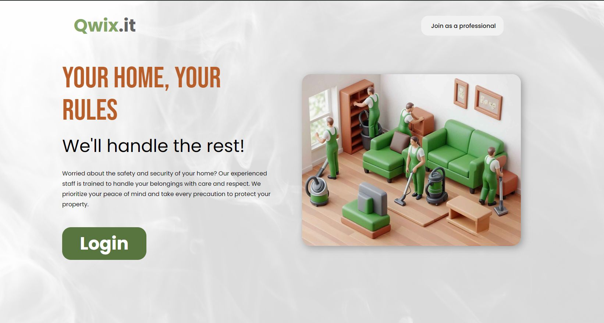
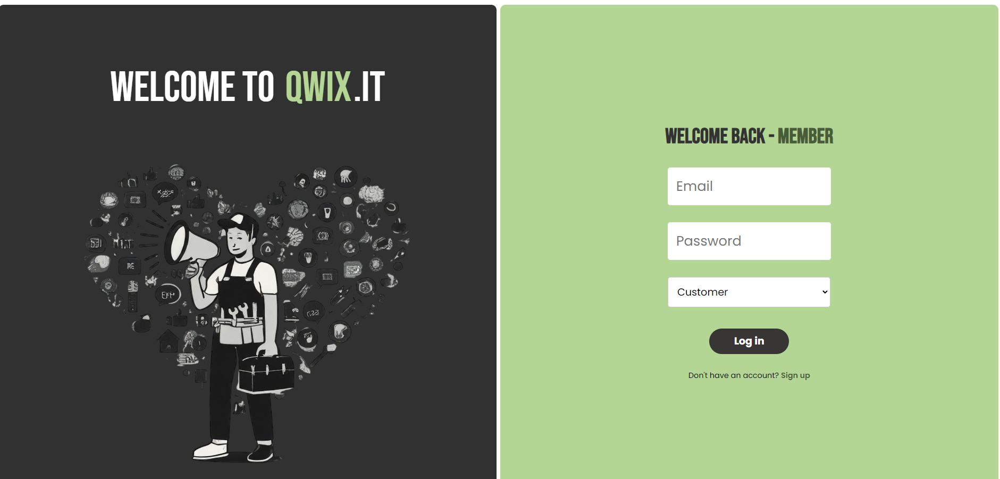
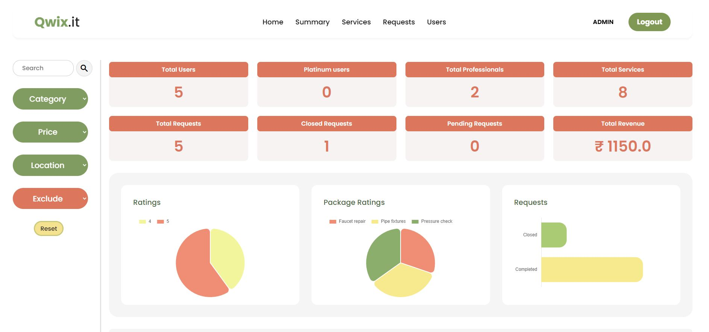
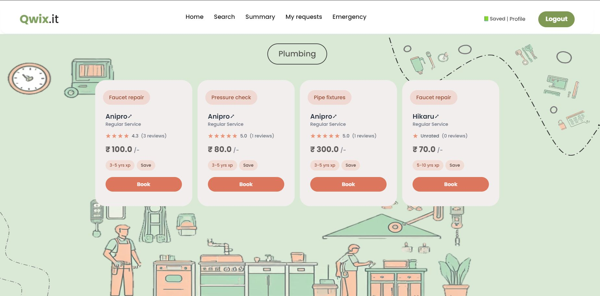
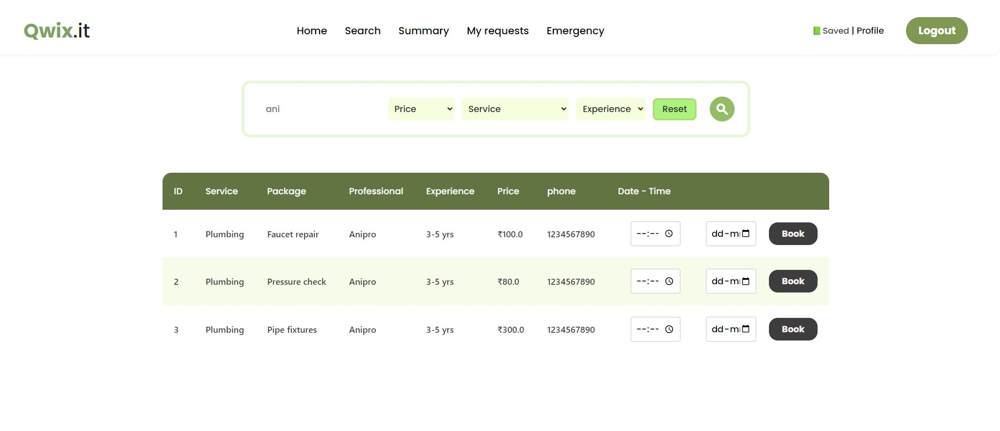
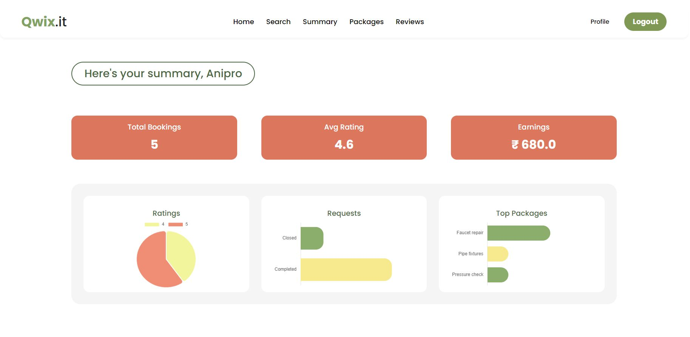

# Qwix.it - Multi-User Household Service App
### 🎥 Watch the Video : 
[](https://youtu.be/47l2mmetJRA)  
[Youtube Qwix.it Showcase](https://youtu.be/47l2mmetJRA)  

- ### Report **[Project Report](https://drive.google.com/file/d/13dBJa5dTYcx_QbIBZ-ltoKqTy1gkvSyM/view?usp=drive_link)**
- ### Wireframe **[qwix.it_wf](https://drive.google.com/file/d/1-vAL9DPS098npn7_ueK7RJrd9t81KhXq/view?usp=drive_link)**
- ### ER Diagram **[ER-D_qwix](https://drive.google.com/file/d/12yD2KjGC5nywPD2Wh0VQZg7CdiH9ez5w/view?usp=drive_link)**
- ### API DOCS **[postman_cwx](https://documenter.getpostman.com/view/39807346/2sAYHxojVK)**
---
## Features
Qwix.it serves as a platform for connecting service professionals with customers seeking various household services. This application enables:  
- **Customers**: Easily search and book services, track requests, and provide feedback.  
- **Service Professionals**: Accept/reject requests, manage services, and customize packages.  
- **Admin**: Oversee the platform, manage user accounts, and ensure smooth operations.
- Service booking, request tracking, and feedback mechanisms for users.  
- Comprehensive management tools for professionals and administrators.

---

## Setting Up the Development Environment

### Requirements
- **Python 3.x**: [Download Python](https://www.python.org/downloads/)  
- **pip**: Usually bundled with Python installations.  

### Instructions

#### 1. Download the Code
Clone the repository using Git:  
```bash
git clone https://github.com/1mystic/Qwix.it-app.git

```  
or download as a ZIP file:  
Navigate to the project's repository.  
Click "Code" → "Download ZIP".

### 2. Create a Virtual Environment (Recommended)
A virtual environment helps isolate project dependencies.

```bash
# Linux/macOS
python3 -m venv venv
source venv/bin/activate

# Windows
python -m venv venv
venv\Scripts\activate.bat
```
### 3. Install Dependencies
```bash
Activate the virtual environment (if created) and install required libraries:
pip install -r requirements.txt
```
### 4. Running the Application
Start the Flask development server:

```bash
python main.py
```
Access the app at http://127.0.0.1:5000/ (default port)

## Screenshots

Home

Login

Customer Dash

Admin Dash

Services

Search

User Summary

